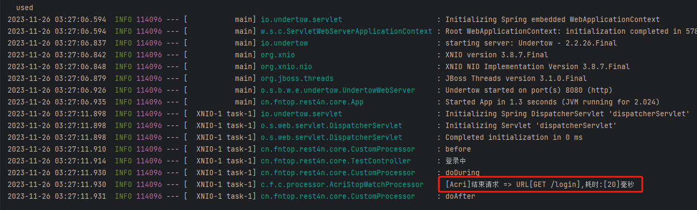

<div align="center">


<p>🍍🍍Acri 注解式自定义请求拦截🍍🍍</p>
</div>

<div align="center">

<div style="display: flex; justify-content: center;">  
    
    
    
    

</div>

<div style="display: flex; justify-content: center;">  
    
    
    
    
</div>

</div>

# 🍌🍌介绍
Acri注解式自定义请求拦截（全称Annotation custom request interception）
使用一个简单的注解即可实现请求的拦截处理

# 🍊🍊特点

* 一个`@Acri`注解即可实现请求拦截
* 支持请求before、during、after `单一`或`同时`处理
* 支持`自定义请求拦截器`，多个拦截器可`隔离控制`并且每个拦截器均可单一或同时处理

## 🍋🍋版本说明
| version | spring boot version | java version |
|:-------:|:-------------------:|:------------:|
|  1.0.0  |        2.7.15        |     1.8      |

## 🫐🫐依赖
如果`Release`版本不可用，请使用`1.0.0-SNAPSHOT`
```xml
<dependency>
    <groupId>cn.fntop</groupId>
    <artifactId>acri-core</artifactId>
    <version>1.0.0</version>
</dependency>

implementation 'cn.fntop:acri-core:1.0.0'
//方式2
implementation group: 'cn.fntop', name: 'acri-corer', version: '1.0.0'
``` 


## 🍐🍐注解说明
`@Acri(value = AcriStopWatchProcessor.class, before = true, during = true, after = true)`

| 配置项    | 默认值   | 备注                                 |
|:-------|:------|:-----------------------------------|
| value  | null  | 具体拦截处理器，实现AcriProcessor并注入Spring容器 |
| before | false | 是否处理请求前执行doBefore方法                |
| during | false | 是否处理请求方法后执行doDuring方法              |
| after  | false | 是否在返回响应后执行doAfter方法                |

`@Acries(more = {@Acri(value = AcriStopWatchProcessor.class, before = true, after = true)
, @Acri(value = CustomProcessor.class, before = true, after = true)})` 
如果存在`@Acries`注解，则`@Acri`注解不起作用

| 配置项    | 默认值   | 备注                                 |
|:-------|:------|:-----------------------------------|
| more  | null  | 批量@Acri |

# 🍈🍈使用方式

## 添加拦截器

```java
@Configuration
public class AcriConfig implements WebMvcConfigurer, ApplicationContextAware {
private ApplicationContext applicationContext;
    @Override
    public void addInterceptors(InterceptorRegistry registry) {
    // 全局拦截
    registry.addInterceptor(new AcriIntercepter(applicationContext));
    }

    @Override
    public void addResourceHandlers(ResourceHandlerRegistry registry) {
    }

    @Override
    public void setApplicationContext(ApplicationContext applicationContext) throws BeansException {
        this.applicationContext = applicationContext;
    }
}

```

## 添加注解

```java
@Acri(value = AcriStopWatchProcessor.class, before = true, during = true, after = true)
@GetMapping("/login")
public String login() {
    log.info("登录中");
    return "登录成功";
}
```
## 效果


# 🍉🍉自定义拦截
```java
@Slf4j
@Component
public class CustomProcessor implements AcriProcessor {
    @Override
    public void doBefore(HttpServletRequest request, HttpServletResponse response, Object handler) {
        log.info("before");
    }

    @Override
    public void doDuring(HttpServletRequest request, HttpServletResponse response, Object handler, ModelAndView modelAndView) {
        log.info("doDuring");
    }
    @Override
    public void doAfter(HttpServletRequest request, HttpServletResponse response, Object handler, Exception ex) {
        log.info("doAfter");
    }
}
```

# 🍏🍏多拦截支持

```java
@Acries(more = {@Acri(value = AcriStopWatchProcessor.class, before = true, after = true)
            , @Acri(value = CustomProcessor.class, before = true, after = true)})
@GetMapping("/login")
public String login() {
    log.info("登录中");
    return "登录成功";
}
```

# 🥝🥝群聊

`QQ群：697135336`
`微信：gensui_`


